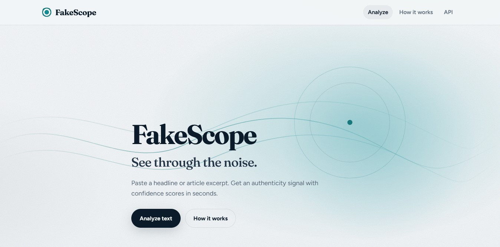

# FakeScope — AI Fake News Detection

<p align="center">
  
</p>

Production-ready Flask web app that scores news headlines and articles as **FAKE** or **REAL** using a TF-IDF + scikit-learn pipeline.

## Features

- Polished multi-page UI (Analyze, How it works, API docs)
- JSON API with input validation, rate limiting, and structured errors
- App factory architecture, gunicorn + Docker deployment
- Auto-trains models on first launch if artifacts are missing
- Health and metrics endpoints for ops

## Quick start

```bash
# 1. Create a virtual environment
python -m venv .venv

# Windows
.venv\Scripts\activate

# macOS / Linux
source .venv/bin/activate

# 2. Install dependencies
pip install -r requirements.txt

# 3. Train models (uses dataset/news_dataset.csv or generates one)
python train.py

# 4. Run the development server
python run.py
# → http://127.0.0.1:5000
```

## Deploying (Render)

`render.yaml` is a ready-to-use Render Blueprint (Docker build, health check on `/health`, auto-generated `SECRET_KEY`). In Render: **New +** → **Blueprint** → pick this repo → **Apply**.

### Keeping it awake on the free tier

Render's free web services spin down after a period of no inbound traffic and take ~30-60s to cold-start on the next request. A scheduled GitHub Actions workflow (`.github/workflows/keepalive.yml`) pings `/health` every 5 minutes to keep it warm:

1. After deploying, copy your Render URL (e.g. `https://fakescope.onrender.com`).
2. In the GitHub repo: **Settings → Secrets and variables → Actions → Variables** → add `KEEPALIVE_URL` with that value.
3. The workflow picks it up on its next scheduled run (or trigger it manually via **Actions → Keep Render instance awake → Run workflow**).

Note: GitHub disables scheduled workflows after 60 days with no repo activity — a free push or manual re-enable resets that.